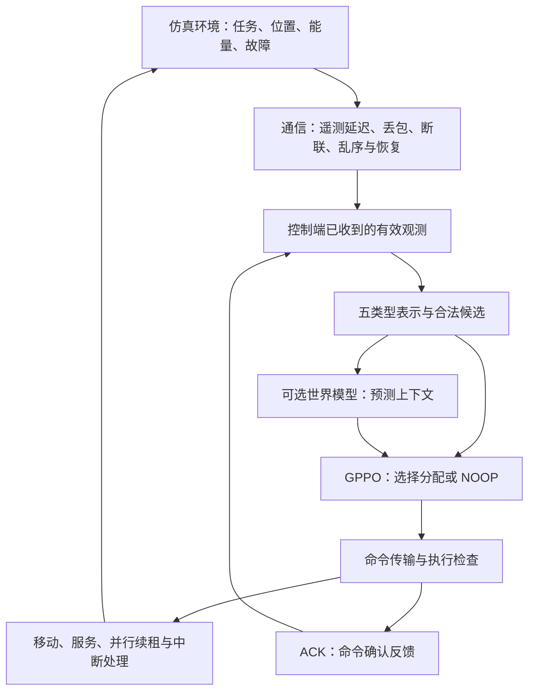

# GPPO-WORLD：弱通信下的无人机集群任务分配

**快速入口：** [资料总索引](docs/README.md) · [最新结果与限制](docs/11-current-project-status-20260910.md) · [场景与实验参数](docs/12-weak-communication-scenario-explained-20260910.md) · [模型及归档下载](https://github.com/Battleplus/GPPO-WORLD-9.2/releases)

当前结论：已完成训练与冻结模型复评；世界模型稳定收益未建立，完整弱通信可用性未通过。最新报告与勘误优先从资料总索引进入，历史报告保留原版本。

> 研究问题：当无人机状态更新不及时，又发生紧急任务、损毁或能量不足时，如何分配和接管任务？世界模型提供的预测能否帮助 GPPO 做出更好的决策？事件触发能否在保持任务效果的前提下减少计算？

本项目实现的是**任务分配与执行过程的仿真研究系统**，不是飞控软件。本文以当前 **M-10 五类型表示及弱通信实现**为主线，说明问题、设计、代码和研究规划；早期三类型基线、训练记录及历史验收通过文末链接查阅，不与当前实现混用。

**阅读导航：** [情景与术语](#1-用一个场景理解项目) · [系统设计](#3-系统如何实现) · [世界模型融合](#4-世界模型与-gppo-到底怎样融合) · [实验比较](#5-如何比较才回答得出研究问题) · [研究规划](#6-关键问题与后续研究规划) · [代码与资料](#8-实现与证据入口)

**分支说明：** `main` 是项目首页并保留早期源码；当前 M-10 实现请进入 [execute-r02-20260905 分支](https://github.com/Battleplus/GPPO-WORLD-9.2/tree/execute-r02-20260905)。下文 M-10 代码与材料链接已指向对应分支，运行时请使用报告指定的源码、模型和配置组合。

## 1. 用一个场景理解项目

无人机 A 正在执行巡检任务，B 正在处理另一项任务，C 可以接替。此时 A 断联，但控制端延迟收到消息，同时出现一个有截止时间的紧急任务。

系统需要回答：A 的任务是否真的中断？控制端现在知道什么？C 是否有足够电量和时间接管？应该先救原任务还是处理新任务？发出的接管命令是否被接受？接管后是否真的恢复了服务？

难点不只是“选哪架无人机”，还包括**信息是否有效、命令能否执行，以及剩余时间是否足够完成任务**。因此，策略网络、通信模型和执行规则必须组成一个闭环。

### 1.1 先认识这些词：沿着一次接管过程理解

下面继续使用“A 中断任务、C 尝试接管”的例子。例中的时间和数值仅帮助理解，不是实验参数或实测结果。**控制端**指汇总已收到的信息并作出分配决定的程序；**UAV**就是无人机。

#### 第一步：控制端怎样知道现场发生了什么？

| 名词 | 通俗解释 | 放进场景里理解 |
|---|---|---|
| 遥测（telemetry） | 从执行端传回的状态信息，如位置、电量和任务进展；不是下发命令 | A 发回“我在位置 P，剩余电量 40%”。控制端收到后，才拥有这条状态记录 |
| 采样时间 / 接收时间 | 状态被测量的时刻 / 消息到达控制端的时刻 | 电量在第 10 秒测得，第 13 秒收到；收到时已经是 3 秒前的信息 |
| 延迟 / 信息年龄 | 延迟是消息传送耗时；信息年龄是当前时间距测量时刻多久 | 上述消息的传输延迟是 3 秒；到第 15 秒再次使用时，信息年龄已是 5 秒 |
| 丢包 / 连续断联 | 丢包是某条消息没送到；连续断联是一段时间内连接不可用 | 没收到一次电量上报，不足以断定 A 已损毁；持续断联则可能影响一段时间内的通信和执行 |
| 乱序 / 重复投递 | 新消息先到、旧消息后到 / 同一消息到达多次 | 第 12 秒的状态先到了，第 10 秒的状态随后才到；不能用后来到达的旧状态覆盖新状态，也不能把重复消息当两次新事件 |
| stale（信息陈旧） | 信息存在，但已经不满足当前新鲜度或版本要求 | 知道 C 过去有电，不代表现在仍可接管；旧电量可能不能用于本次候选判断 |
| 公开观测 / 隐藏真值 | 控制端已合法收到的信息 / 仿真环境内部的实际状态 | A 实际在第 10 秒断联，消息第 13 秒才到；策略不能在第 11 秒偷读故障表，提前知道断联 |

“公开”是指**允许策略读取**，不是指数据公开上网。弱通信也不等于完全没有通信，而是信息可能来得慢、不完整或不连续。

#### 第二步：怎样决定让谁接管？

| 名词 | 通俗解释 | 放进场景里理解 |
|---|---|---|
| Task / Target / Region | 具体工作 / 工作对应的对象 / 对象所在区域 | “检查设备 X”是一项 Task，设备 X 是 Target，所在区域是 Region；同一目标可以关联多项任务 |
| 图、节点与关系 | 把实体及它们之间的联系组织起来 | A、C 和任务各有自己的特征；“C 到任务有多远、能否分配”属于候选关系信息 |
| 候选 / mask | 可以考虑的分配组合 / 标记哪些组合当前允许选择的布尔表 | C–原任务可能合法，能量不足的 B–原任务被排除；候选合法仍不保证命令到达时也合法 |
| 策略（policy）/ actor | 根据输入给动作打分并选择动作的网络 | 在“C 接原任务”“C 接紧急任务”和“暂不新增分配”之间作出选择 |
| PPO（近端策略优化） | 利用交互经验训练策略，并限制更新幅度的一种方法 | 根据过去分配后的完成、过期和能耗反馈，逐步调整候选选择倾向；不是写死“永远选最近无人机” |
| critic / 奖励 / 回报 | critic 估计后续累计收益；奖励是一次交互的反馈；回报是多步奖励的累计 | 派出 C 后可能先消耗能量，再获得完成收益；不能只看眼前一步，也不能把回报直接当成完成率 |
| 世界模型 / context（上下文） | 学习预测后续信号的模型 / 交给策略的一组预测特征 | 在选择接管前提供附加预测信息。当前实现把合法候选的预测上下文平均后融合，不能直接解释为“C 接管成功概率” |
| 周期决策 / 事件触发 | 每个决策周期重新选动作 / 满足规定条件时才重新选动作 | 周期策略每次都检查分配；触发策略在获知故障、出现新任务等条件满足时重新选择，其他时候维护已有执行 |
| NOOP / continuation | 不新增分配 / 继续维护已有合法执行 | 本周期没有新任务可派时，可以 NOOP；C 已经在服务时，continuation 维护其执行，不能重复提交同一分配 |

#### 第三步：选中了 C，为什么还要检查命令？

| 名词 | 通俗解释 | 放进场景里理解 |
|---|---|---|
| 命令 / ACK（确认反馈） | 请求执行某个分配 / 对该命令接受情况的反馈 | “C 接管任务 T”是命令；ACK 表示对应命令被确认，不表示任务已经完成。ACK 丢失也不等于命令一定没执行 |
| 版本（version） | 标识作出决定时依据的是哪一版状态 | 控制端按旧版本派 C，但任务已转交他人，执行端应拒绝过时分配 |
| lease（租约）/ 续租 | 有期限的执行资格 / 按规则延长资格 | C 获得一段时间内的执行资格；要继续执行需保持有效租约，不能无限沿用旧许可 |
| fencing token（执行代次标识） | 区分新旧执行资格，阻止旧持有者重新抢占 | 任务交给 C 后，A 的旧命令迟到，也不能凭旧资格重新夺回任务 |
| 独占 / 并行执行 | 同一任务不能被冲突占用 / 不同合法任务可以同时推进 | C 接管 T 时不能和 A 重复执行 T，但 B 仍可继续自己的另一项任务 |
| 安全门禁 / 正确拒绝 | 执行前检查 / 不满足规则时拦住命令 | 租约失效或能量不足时拒绝，是规则正常工作；重复或越权命令被接受才是安全问题 |

#### 第四步：怎样才算“恢复了”？

| 名词 | 通俗解释 | 放进场景里理解 |
|---|---|---|
| deadline / 时间余量 | 最晚完成时刻 / 距该时刻还剩多久 | 任务第 30 秒截止，获知故障时已到第 25 秒，只剩 5 秒；C 还需移动 4 秒、服务 3 秒，就已来不及 |
| 服务量 / 有效服务 | 任务还需要完成的工作量 / 执行端实际推进了任务 | 接受命令或飞向任务都不算服务；C 到达后真正推进剩余工作，才有有效服务证据 |
| 接管 / 服务恢复 / 按时完成 | 替代命令被接受 / 替代资源开始有效服务 / 在 deadline 前做完 | C 接单后可能还没到达；到达并工作后也可能来不及做完，所以三项要分别统计 |
| 恢复分母 | 被统计为恢复机会的事件集合 | A 空闲时断联不属于“正在执行的任务被中断”；任务中断却没恢复的事件不能从分母中删掉 |
| 完整决策链延迟 | 从观测处理到预测、选动作和执行接口处理的总耗时，需注明计时边界 | 少调用 actor，但多算世界模型，整体可能仍更慢；它也不等于现场故障到任务恢复的总时间 |

### 1.2 阅读实验设计时还会遇到的词

| 名词 | 在本项目中的含义与例子 |
|---|---|
| episode | 一次从场景开始到结束的完整仿真；一轮结束不代表任务全部完成 |
| step / rollout | 一次环境交互 / 收集起来用于训练的一段交互；环境步数不等于网络参数更新次数 |
| seed（随机种子） | 用来复现随机过程的起点；多个 seed 用于观察不同训练随机性下结果是否一致 |
| tape（场景记录） | 冻结的任务、事件及通信条件记录；便于让不同策略面对可比较的外部条件 |
| checkpoint | 保存的模型参数及可能包含的优化器、恢复状态；它是训练快照，不是能力通过证明 |
| 训练 / 开发验证 / 最终测试 | 分别用于学习参数、选择配置和阈值、最后检验效果；不能看过最终测试后再调参并把它当盲测 |
| OOD（分布外条件） | 与训练条件不同的测试情况，例如更长的断联或不同任务负载；通过某组 OOD 不代表所有陌生条件都能应对 |
| 配对对照 / 消融 | 在相同场景上比较不同方法 / 去掉某个模块观察变化；如 B 对 A 检验世界模型输入的作用 |
| 置信区间 | 表达有限样本下差异的不确定范围；点估计稍好，不一定足以证明稳定改善 |
| ledger（逐条账本） | 保留消息、命令、ACK、租约与服务事件的记录；用来追查“C 究竟何时接单、何时真正工作” |

## 2. 三个部分分别负责什么

| 部分 | 作用 | 需要验证的问题 |
|---|---|---|
| GPPO：图表示与 PPO 策略学习 | 从无人机、任务及其关系中选择一个 UAV–Task 分配，或暂不新增分配 | 能否学会有效分配，而不是长期选择等待？ |
| 世界模型 | 从公开观测和候选动作预测后续信号，形成策略的附加输入 | 预测是否有信息价值，接入后是否改善任务效果？ |
| 事件触发 | 根据公开事件、安全条件、预测风险和最大等待间隔决定是否重新计算动作 | 能否减少总成本，同时保持完成率和恢复能力？ |

这里的 GPPO 指项目中的图表示 PPO 实现。PPO 是训练策略的方法，图表示负责组织输入，两者不是相互替代的算法。世界模型提供信息，最终分配仍由策略选择，并接受执行层检查。

## 3. 系统如何实现



### 3.1 用五类实体组织公开信息

“五类型”是五种实体类别，不是只有五个节点，也不等于五架无人机。

| 类型 | 表示什么 | 当前实现方式 |
|---|---|---|
| UAV | 执行资源 | 位置、能量及可见状态等字段 |
| Task | 待执行工作 | 位置、截止时间、剩余服务量及所属区域、目标等字段 |
| Region | 任务所属区域 | 区域标识，以及从有效公开任务信息汇总的特征 |
| Target | 任务对应目标 | 目标标识及其关联任务的公开汇总特征 |
| Event | 已获知的状态变化 | 有限容量的公开事件记录，例如已收到的连接或存活状态变化 |

策略对实体特征编码，加入类型标识，汇总全局特征；再结合 UAV–Task 的距离、可见性及候选有效性等关系，对每个分配候选打分。当前实现是**实体编码、全局汇总和候选关系评分**，不应描述成已经实现任意多跳图推理。

观测同时保留字段是否已知、是否有效及信息年龄。策略看到的是控制端已经收到的信息，不能直接读取仿真器内部的未来故障表。Event 节点也不代表策略提前知道所有突发事件。

### 3.2 分配不等于完成

每个决策周期最多提交一个新分配；已有多个任务可以并行移动、服务和续租。NOOP 表示本周期不新增分配，不表示停止其他正在执行的任务。

执行过程区分：**任务到达、命令接受、移动、实际服务、完成、过期和中断**。仿真时钟推进移动与服务、消耗能量，并在故障或 deadline 边界更新任务状态。奖励包含任务完成收益，以及过期、能耗和拒绝等成本；验收仍单独看完成与恢复，不能只看总回报。

| 执行机制 | 通俗解释 |
|---|---|
| 合法候选 mask | 决策时按公开信息排除不能选择的分配；发送后状态仍可能变化 |
| 版本校验 | 防止拿旧状态下的决定覆盖当前状态 |
| ACK | 确认对应命令是否被接受；消息丢失时，控制端和执行端可能知道得不一样 |
| lease（执行租约） | 在有限有效期内持有执行资格，续租也必须经过通信与确认链路 |
| fencing（执行代次校验） | 任务转交后，阻止旧命令重新夺回执行权 |
| 独占与能量检查 | 防止冲突占用，以及不满足能量条件的执行 |

活动执行记录按命令、任务和 UAV 管理。一个任务完成、断联或租约到期，不应误清理其他任务。合法候选不保证命令最终被接受，正常的过期或资源不足拒绝也不等于安全违规。

### 3.3 弱通信与突发事件

遥测、命令和 ACK 分为三条逻辑链路。实验逐步加入延迟、随机丢包、连续失联、乱序和恢复，再叠加紧急任务到达、UAV 损毁、能量不足。

必须区分**消息没有送到**和**环境中的 UAV 真实断联**。现有执行规则中，真实断联会中断该 UAV 的服务；控制端只有收到相应公开信息后才能据此决策。恢复连接不意味着旧命令自动重新有效，仍要满足版本、租约及资源约束。

通信随机性按消息语义身份组织，避免某组多发几个命令，就改变其他消息遭遇的随机故障。这里模拟的是通信行为；序列化消息字节数只是通信量代理，不是真实无线网络吞吐。

## 4. 世界模型与 GPPO 到底怎样融合

当前 M-10 世界模型是一个动作条件前馈网络：输入公开观测与动作编码，监督学习**下一环境步的奖励、事件、episode 结束信号及一个 8 维上下文**。事件标签包括损毁、断联、恢复，另有保留槽位。

在线决策时还没有选定动作，因此当前实现对合法候选进行预测，将候选预测上下文取均值，经投影后加入策略的全局特征，再由 GPPO 对具体 UAV–Task 候选评分。世界模型在策略训练期间保持冻结。它不是逐个候选执行多步搜索，也不是在线读取未来真值。

这意味着：

- **已经实现**预测输入接入策略，以及有无预测输入的对照。
- **尚不能直接声称**拥有专门的 deadline 风险、接管成功率或长期规划预测器；这些不是当前模型已经独立训练验证的目标。
- 世界模型的预测误差和策略的任务收益必须分别验证。能输出上下文，不代表上下文有用。
- 随机损毁和丢包可能缺乏可预测信息，不能要求模型准确预知其发生时刻。

事件触发组还会读取预测风险及公开语义事件。未触发时不重新调用动作选择网络，而是维护已有合法执行；**世界模型仍可能被调用**，所以少算几次 actor 不等于整体计算更省。

### 4.1 讨论结论：当前世界模型究竟在做什么

当前模型不是完整的时序动力学世界模型，更准确地说，它是一个**基于当前公开快照和候选动作的单步统计结果预测器**：

\[
(o_t,a_t)\longrightarrow
(\hat r_{t+1},P(\mathrm{event}_{t+1}),P(\mathrm{done}_{t+1}),context_t)
\]

这里的 `o_t` 包含当前合法收到的 UAV、Task、Region、Target、Event、关系、时间、有效性及部分信息年龄摘要；模型没有独立的 GRU/RSSM 历史状态。它可以利用当前快照中留下的历史痕迹拟合相关性，但无法区分“相同当前快照、不同过去轨迹”的状态，也不能准确预知当前合法信息中没有征兆的独立随机损毁或丢包。对于这类不可预测事件，模型最多学习条件发生率或数据中的表面相关性。

世界模型训练样本来自仿真器实际推进的一步转移：

```text
当前公开观测 + 合法动作
→ 环境执行
→ reward、event、done、下一观测
```

即 `(obs_t, action_t, reward_t, event_t, done_t, obs_t+1)`。采集时主要从 action mask 中随机选择合法动作，因此样本是可复现的仿真运行范例，不是人工专家示范，也不保证动作最优。

默认 M-10 配置为 3 架 UAV、6 个任务槽，共 `3 × 6 + 1 = 19` 个动作。动作 `u × 6 + t` 表示把 UAV 槽 `u` 分配给 Task 槽 `t`，动作 `18` 为 NOOP；配置变化时动作数相应变化。GPPO 负责给这些合法候选打分并选出动作，世界模型不直接选择、提交或执行动作。

当前单步奖励为：

\[
r_t=10\,\Delta completed-4\,\Delta expired-0.25\,I(rejected)-0.08\,\Delta energy
\]

NOOP 没有独立惩罚。配置中的 `reward_priority_scale=2.0` 当前没有作为独立奖励项使用。世界模型的 8 维 `context` 监督目标为 `[reward, damage, disconnect, reconnect, reserved_event, done, time_fraction, event_signal]`。

### 4.2 世界模型与 GPPO 候选边的关系

GPPO 的 UAV–Task 边描述**当前关系**，例如两端节点状态、距离、可见性和合法性；actor 根据当前图为候选边打分。世界模型理想上应补充**选择这条边之后的未来后果**，例如到达时间、服务推进、能耗和 deadline 风险。两者的训练信号也不同：GPPO 依赖延迟的累计回报，世界模型使用下一步真实结果进行监督拟合。

当前实现存在较强重叠：二者都读取同一当前观测，世界模型没有额外历史，并且在线决策前会将所有合法动作的预测 `context` 取均值。假如两个候选分别是高风险和低风险，平均后只剩一份全局的中间风险，不能直接告诉 actor 哪条边更好。因此当前世界模型更像全局预测摘要，还没有真正成为每条候选边的未来特征。这是 B 组未建立稳定收益的一个合理机制假设，需要用候选级消融验证，而不是只凭结构推断结论。

更清晰的互补关系应为：

```text
当前 UAV–Task 边：现在是什么情况
候选级世界预测：选择以后可能怎样
GPPO actor：综合两者决定选哪条边
安全执行链：最终裁决动作能否执行
```

### 4.3 为什么第一版采用这种简单融合

M-10 第一版针对会议提出的“先跑通基础功能，再把简单世界模型作为强化学习输入”进行最小工程实现，不是以完整复现 EAWM 为初始目标。采用冻结的单步 MLP 和 8 维 context，主要为了：

- 不改变既有动作编号、mask、ACK、lease、version、fencing 和并行执行合同；
- 先证明预测输出能够被 GPPO 真实消费，并可随时关闭回退；
- 使用同一冻结世界模型形成 A/B/C 对照，减少策略与世界模型同时变化造成的归因困难；
- 在服务器、依赖和训练任务多次中断的条件下，降低 checkpoint、迁移和复现复杂度；
- 直接使用仿真器已有的损毁、断联和恢复语义标签，快速验证事件预测与触发链路。

这个选择适合验证接口、安全和复现，但不能保证算法收益。后续负结果说明“单步预测拼接”和“用事件概率跳过 actor”不足以自动改善弱通信任务分配。

### 4.4 与论文 EAWM 的一致与不同

本项目与论文 [From Observations to Events: Event-Aware World Model for Reinforcement Learning](https://arxiv.org/abs/2601.19336) 在“用事件预测塑造对动态变化敏感的表示”这一方向上一致，但当前 M-10 简化模型与论文完整方法不同：

| 方面 | 当前 M-10 简化模型 | 论文 EAWM |
|---|---|---|
| 时间建模 | 当前快照，没有独立序列隐状态 | 序列模型维护历史 latent state |
| 动力学 | 单步 reward/event/done/context | latent dynamics、observation、reward、continuation 和 event 联合建模 |
| 事件标签 | 仿真器语义事件 | 从相邻多模态观测变化自动生成 |
| 事件作用 | context 直接加入策略，并用于运行时风险触发 | Event Predictor 主要作为辅助损失塑造 latent 表示 |
| GES/触发 | 预测风险决定是否重新调用 actor | GES 调节训练时 observation/event loss，不是控制层重规划触发器 |
| 策略训练 | PPO 继续在真实仿真 rollout 上学习 | actor/critic 主要在世界模型 imagined trajectories 上优化 |
| 正式阶段 | pilot 先训世界模型，formal 冻结使用 | 环境采样、世界模型更新和想象策略学习交替进行 |

当前方法的优势是简单、可关闭、易审计，并确保真实 mask 和执行安全链保持权威；劣势是缺少历史、多步动力学和候选级后果，容易与 GPPO 边编码重复。论文方法更有能力利用历史和想象轨迹，但训练更复杂，存在模型误差累积及策略利用虚假 ACK/lease 状态的风险，也不能直接从视觉控制结果推断对结构化 UAV 调度必然有效。

### 4.5 建议的渐进实现路线

不应直接推翻现有系统照搬视觉版 Dreamer。更适合本项目的顺序是：

1. **GPPO-History**：先用合法公开的 observation、action、消息年龄、ACK、lease 和服务反馈构建 GRU/RSSM 状态，判断主要缺口是否只是历史记忆。
2. **候选级单步后果模型**：为每条 UAV–Task 边分别预测到达时间、服务开始/推进、能耗、deadline miss、命令/lease 失败风险和不确定性，不再平均合法动作 context。
3. **事件辅助表示学习**：从公开状态变化生成任务到达、故障获知、fresh-to-stale、lease 变化、服务中断/恢复及完成事件；稀疏事件使用 focal loss，并与频率、持续性和物理规则基线比较。
4. **短期 latent imagination**：只有前述预测在独立验证集上有效时，才增加 1～5 步短期想象；高不确定性时截断，所有 imagined 状态仍不能取得真实 ACK、lease 或绕过安全门禁。
5. **重新规划价值触发**：周期决策版本有效以后，再预测“立即重规划相对继续执行的价值差”，而不是直接把随机事件概率当成是否调用 actor 的依据。

至少比较合法规则/滚动规划器、GPPO、GPPO-History、GPPO-History＋普通 dynamics、GPPO-History＋Event-Aware dynamics。只有在相同历史输入、动作、安全合同、tape、seed 和交互预算下，Event-Aware 版本仍改善独立测试的任务完成、deadline 或有效恢复，才能把收益归因于世界模型；训练充分不能创造输入中不存在的信息。

## 5. 如何比较，才回答得出研究问题

主对照固定为以下三组。图表示、动作、奖励、通信和执行规则保持一致，并使用相同场景生成规则、环境交互预算和配对评估场景。

| 组别 | 决策方式 | 比较目的 |
|---|---|---|
| A：GPPO | 每周期选择动作 | 基础任务分配能力 |
| B：GPPO＋世界模型 | 每周期选择动作，增加预测上下文 | B 对 A：预测输入是否改善任务效果？ |
| C：GPPO＋世界模型＋事件触发 | 满足触发条件时重新选择动作 | C 对 B：是否在保持效果时节省成本？同时报告 C 对 A |

合法规则调度器作为执行与可行性参考，不包装成强化学习成果。训练、开发、最终测试和分布外场景分开；模型与阈值只根据训练、开发数据确定。旧测试反复使用后只能作为历史回归，不能继续称为新的盲测。

核心指标是任务完成率、deadline 违约、有效服务恢复及其耗时、重复或越权执行。辅助记录能耗、正确拒绝、通信代理量，以及包含观测构建、世界模型、策略和执行接口的完整决策链延迟。

恢复必须关联**确有任务被中断的事件**，再分别记录合法获知、候选形成、替代命令接受、替代资源服务和按时完成。不能拿所有故障数作恢复分母，也不能把事件发生前的命令接受算成接管。未恢复事件保留在结果中，不通过删除失败样本缩短平均恢复时间。

## 6. 关键问题与后续研究规划

以下是研究顺序和判断依据，不是训练进度表，也不表示这些目标已经通过。

| 要解决的问题 | 设计与验证方式 | 推进依据 |
|---|---|---|
| 基础分配是否真正可用？ | 在明确可行的任务中验证分配、并行服务、能量和 deadline，再逐步增加通信压力 | 真实完成任务，而不只是 episode 结束或安全计数为零 |
| 恢复失败到底卡在哪里？ | 沿“获知—候选—选择—传输—服务—完成”逐事件定位 | 区分信息过期、选择不足和物理上来不及，不能全部归因于训练不够 |
| 世界模型究竟应预测什么？ | 核对现有目标与接管需求；新增预测目标时先定义窗口、标签和公开输入，与简单基线比较 | 开发数据支持目标具有可预测性，不预设随机故障必然可预测 |
| 更多训练能否改善分配？ | 在冻结分布上做有预算上限的多 seed 对照，保留逐事件训练记录、验证曲线与恢复状态 | 以独立测试和配对差异判断，不按旧策略失败逐条筛选样本 |
| 触发能否做到效果与成本兼顾？ | 先比较 A/B，再评价 C；同时计量 actor、世界模型、通信和完整延迟 | 减少调用时仍保持任务效果，不能用漏做任务换取“加速” |
| 仿真结论能否用于实际系统？ | 明确任务规模、通信要求、控制周期和恢复时限，再开展真实链路适配 | 仿真时间与代理流量不能直接当作实网指标 |

同状态接管比较可作为后续补充设计：用独立公开控制器生成共同前缀，在真实任务中断处复制环境，各策略从相同公开历史重建自己的内部状态，再比较后续接管。该设计用于减少“不同策略原本就在执行不同任务”的干扰，结论仍限定在共同前缀的条件分布，不能替代端到端任务评估。

## 7. 当前应怎样理解项目结论

**系统已经具备图策略、世界模型输入融合、事件触发及弱通信执行仿真的研究链路，但尚未证明世界模型带来稳定任务收益，也未证明触发策略能够兼顾任务效果与整体成本。完整弱通信可用性仍未通过。**

当前证据支持继续围绕明确问题做受控研究，不支持将“训练完成”“模型调用减少”写成算法优势。返航、换电、充电、长期失联自主执行和真实飞行控制不属于当前已实现能力；是否纳入最低验收，仍需结合实际任务明确。

## 8. 实现与证据入口

### 目录怎么找

| 位置 | 放什么 | 建议读法 |
|---|---|---|
| `README.md` | 面向老师与同学的项目介绍 | 先读场景、设计和研究问题 |
| `gppo_world/` | 环境、模型、策略和执行逻辑 | 查看下方 M-10 精确源码入口 |
| `tools/` / `tests/` | 运行工具 / 行为与合同测试 | 按对应实验报告选择入口，不混用历史脚本 |
| `docs/` | 设计、解释与口径修订 | 优先读当前场景说明与勘误；早期设计保留作背景 |
| `nodes/M-10/` | 当前研究线的协议、报告和证据索引 | 查看具体实验及其能力边界 |
| `nodes/M-09/` 及其他阶段目录 | 历史规划与实验 | 按阶段阅读，不把历史通过状态当作当前结论 |
| GitHub Releases | 冻结模型、数据与归档 | 通过报告对应版本下载，不按文件日期猜版本 |

[弱通信场景与具体参数说明](https://github.com/Battleplus/GPPO-WORLD-9.2/blob/main/docs/12-weak-communication-scenario-explained-20260910.md) · [统一进度与数值口径](https://github.com/Battleplus/GPPO-WORLD-9.2/blob/main/docs/11-current-project-status-20260910.md)

### 看代码：从哪里理解实现

| 入口 | 内容 |
|---|---|
| [环境与观测构建](https://github.com/Battleplus/GPPO-WORLD-9.2/blob/execute-r02-20260905/gppo_world/m10_environment.py) | 五类型输入、任务事件、通信接入和并行活动执行 |
| [策略、世界模型与 PPO](https://github.com/Battleplus/GPPO-WORLD-9.2/blob/execute-r02-20260905/gppo_world/m10_training.py) | 候选评分、预测上下文、触发判断、采样和更新 |
| [策略可见信息](https://github.com/Battleplus/GPPO-WORLD-9.2/blob/execute-r02-20260905/gppo_world/task_policy_view.py) | 控制端可读状态与候选构建 |
| [命令桥接](https://github.com/Battleplus/GPPO-WORLD-9.2/blob/execute-r02-20260905/gppo_world/task_decision_bridge.py) / [执行层](https://github.com/Battleplus/GPPO-WORLD-9.2/blob/execute-r02-20260905/gppo_world/task_execution.py) | 分配命令、确认与执行门禁 |
| [服务时钟](https://github.com/Battleplus/GPPO-WORLD-9.2/blob/execute-r02-20260905/gppo_world/service_clock.py) / [任务生命周期](https://github.com/Battleplus/GPPO-WORLD-9.2/blob/execute-r02-20260905/gppo_world/task_lifecycle.py) | 移动、服务、事件边界及任务状态 |
| [遥测结构](https://github.com/Battleplus/GPPO-WORLD-9.2/blob/execute-r02-20260905/gppo_world/telemetry.py) | 消息与信息有效性 |
| [弱通信实验入口](https://github.com/Battleplus/GPPO-WORLD-9.2/blob/execute-r02-20260905/tools/run_m10_weak_comm.py) / [冻结模型复评迁移包](https://github.com/Battleplus/GPPO-WORLD-9.2/releases/tag/m10-metrics-replay-migration-v1-20260909) | 训练对照与不更新参数的复现评估 |

### 看细节：协议、结果和历史记录

- [弱通信实验协议](https://github.com/Battleplus/GPPO-WORLD-9.2/blob/execute-r02-20260905/nodes/M-10/m10-weak-communication-protocol.md)：对应版本的链路、参数和边界；其中时间参数是仿真设定。
- [并行执行与租约设计说明](https://github.com/Battleplus/GPPO-WORLD-9.2/blob/execute-r02-20260905/nodes/M-10/m10-parallel-lease-continuation-fix.md)：单次新分配与持续并行服务的区别。
- [正式训练技术报告](https://github.com/Battleplus/GPPO-WORLD-9.2/blob/execute-r02-20260905/nodes/M-10/m10-authorized-resume-fix-v1-report.md)：实验配置、训练结果、失败与限制。
- [CPU 复评口径勘误](https://github.com/Battleplus/GPPO-WORLD-9.2/blob/execute-r02-20260905/docs/m10-local-cpu-replay-erratum-20260910-v2.md)：成本比较、接管事件和安全声明的更正；相关指标应与原报告合读。
- [训练制品索引](https://github.com/Battleplus/GPPO-WORLD-9.2/blob/execute-r02-20260905/nodes/M-10/m10-authorized-resume-fix-v1-artifact-index.md) / [复评与勘误 Release](https://github.com/Battleplus/GPPO-WORLD-9.2/releases/tag/m10-local-cpu-replay-20260910-v1)：模型、日志及校验资产。
- [阶段状态](https://github.com/Battleplus/GPPO-WORLD-9.2/blob/execute-r02-20260905/nodes/M-10/status.json) / [早期 M-09 规划](https://github.com/Battleplus/GPPO-WORLD-9.2/blob/execute-r02-20260905/nodes/M-09/README.md) / [全部历史 Release](https://github.com/Battleplus/GPPO-WORLD-9.2/releases)：进度、归档和历史实验；各版本结论按对应协议解释。
